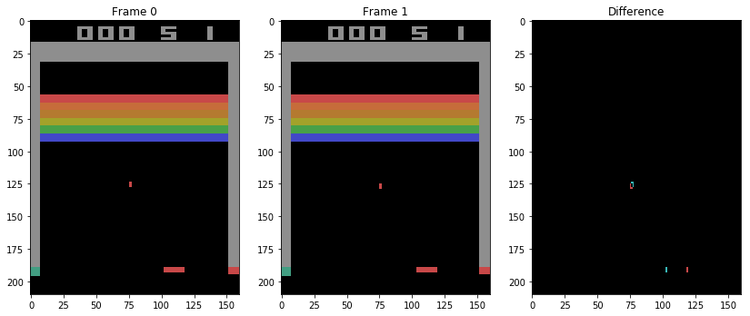
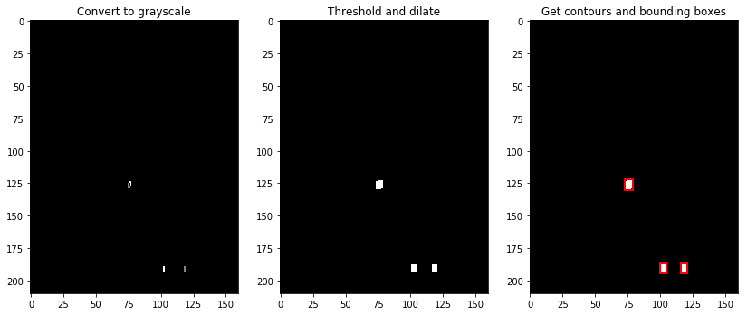
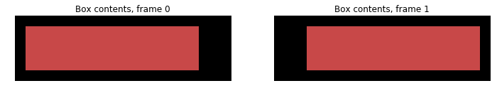
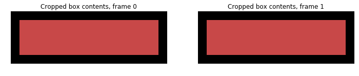

# piaget
Visual reinforcement learner with "developmental stages"

Note: This is a personal project which is currently in the "trying lots of experiments to find out what works" stage.  The experimentation takes place in the Juypter Notebook files, while experimental code that works well enought to keep and build upon goes in the Python files.  This README doesn't intend to make everything in the code comprehensible (since I am continually changing it), but tries to explain the general idea and the components which are relatively well established (as of 7/17/17).

The first section below, [Motivation](#motivation), describes the ideas about deep reinforcement learning that inspired this experiment.  If you're looking for what the code actually does, see the second section, [Piaget](#piaget-1), and the demo notebook, `piaget_demo.ipynb`.  (The demo notebook provides a better introduction than can be done in text, so I recommend checking it out.)

##  Motivation

### Data Efficiency

There are at least two distinct metrics one can use to evaluate an algorithm that "learns" over time: asymptotic performance and data efficiency.  The former asks how well the computer can perform after a fixed amount of *computing* time, while the latter asks how well the computer can perform after a fixed length of experience with the task.

An interesting property of deep reinforcement learning algorithms (as pioneered by DeepMind) is that they can frequently match or surpass humans in asymptotic performence, but tend to be far, far less data-efficient than humans.  For instance, in [DeepMind's 2014 paper](https://storage.googleapis.com/deepmind-media/dqn/DQNNaturePaper.pdf) on deep Q-learning for Atari games, the algorithm could (using a single set of hyperparameters) ultimately play many games as well as a human or better -- but this asymptotic high performance was the result of 50 million frames of interaction per game, the equivalent of playing a each game for about 38 days straight.  By contrast, the human testers used to establish "human-level" game performance were allowed 2 hours of practice per game.  (N.B.: a [DeepMind paper from March 2017](https://arxiv.org/abs/1703.01988) proposes a fascinating new algorithm, Neural Episodic Control, motivated in part by these data efficiency concerns.)

A natural objection to the above comparison -- 38 days for the algorithm, 2 hours for the humans -- is that the human testers arrive with a lifetime of relevant experience, in tasks involving vision, moving objects, real-world physics, etc.  Meanwhile,  the algorithm is a general learner, not allowed to "smuggle in" such domain-specific information.  However, this latter claim is only partially true.  The ConvNet architecture, a crucial piece of the algorithms under discussion, is domain-specific: it is designed to exploit data sets which have been sampled from known points in a space with a known metric (notion of distance), such as pixels in a 2D image, samples in a recorded sound wave, or spaces on a game board.  We would not expect ConvNets to perform well on data which has nothing like this structure (for instance, on images whose pixels have been rearranged in some deterministic-but-unknown way).

Moreover, the deep ConvNet architecture has close analogies to our best models of the mammalian visual cortex, which contains sequential layers of topographicaly organized cells with local connectivity.

So there are reasons to believe that when deep reinforcement learners do well as humans, it is because they are using domain-specific information, and using it in some of the ways we do.

### Development

Humans are not built with all our domain-specific knowledge fully in place.  We metaphorically -- and literally! -- crawl before we can walk.  This is true even for very basic and dependable regularities in our environments.

For instance, cells in our primary visual cortex (relatively early in visual processing) are receptive to lines in specific orientations, much like the filters one might expect to see in an early layer of a visual ConvNet (cf. [Gabor filters](https://en.wikipedia.org/wiki/Gabor_filter)).  But these filters are not precisely pre-programmed by the genome.  Instead, the genome "initializes" a network which will develop the correct filters when "trained" in a natural environment in early life.  In several famous experiments (see e.g. [this paper](https://pdfs.semanticscholar.org/5267/a2049b9c11d0deca2eb4a670e6f4aaa58dce.pdf)), cats were raised in artificial environments containing only lines in one specific orientation, and they did not develop the usual full repertoire of orientation-selective cells.

In other words, just like deep neural nets, mammalian brains have to be "trained" for a while before they can get anywhere useful.  But once we *do* get something figured out, we tend *keep* it.  Cats and people do spend some amount of time, in childhood, wiring up the filters of their visual system, but after that, we never need to figure out how to see again.  When we sit down to play an Atari game for the first time, we can depend on the orientation-selective filters we developed as babies, and stuck with every since.  By contrast, standard artificial neural nets reinvent everything from scratch every time they are trained.  They re-learn to see every time we train them on a different game, or every time we vary a hyperparameter.

So while humans do have domain specific prior knowledge, we acquire that knowledge in a process of *learning* rather than mere hard-coding.  But we seem to do it in a sequential, planned manner -- building lower-level models, fixing them in place, and then building higher-level models on top of them, searching at each stage for the information most relevant to the type of model we are then constructing.

### Atari

Let's be a lot more concrete.  If I sit down to play an Atari game I've never seen before, I have a lot of expectations.  Not just that I'll be interacting with a two-dimensional spatial world (a bit of domain knowledge captured in the ConvNet architecture), but that motion is important, that there are persistent *objects* which move, that these objects are probably more important than static parts of the background, that it is probably important when these collide.

If you start with the not-especially-strong, physically motivated assumption that *moving things are persistent and important*, you can immediately extract a lot of information from the first few frames of an Atari game.  Take the difference between frames and identify the (typically small) regions where something has changed.  These usually correspond to moving objects (sprites).  Track which regions have similar positions as time elapses, take snapshots of those regions and apply some basic computer vision to them, and you've got reliable images of the most significant moving objects in the game, plus a sample trajectory for each one -- within as few as 5, 10, or 15 frames.  Use the snapshots to initialize the first layer of a ConvNet, and the observed motions to initialize the second layer, and after 15 frames you've got a set of filters that pinpoint the most important things in the game.  All of this assumes a fair amount about the visual/spatial structure of the environment -- but then, so do ConvNets alone.

## Piaget

Piaget is an attempt to apply the above ideas to the Atari environments in the [OpenAI Gym](http://gym.openai.com/).

Piaget currently has two basic "developmental stages":

1. A stage that uses traditional computer vision (with OpenCV) to identify moving objects in the game.

2. A stage that trains a ConvNet-based model, in which the first two layers contain fixed (non-trainable) filters based on information extracted in Stage 1.

Typically, I will run Stage 1 for somewhere in the range of 10-50 frames, then move on to Stage 2.  (Because Stage 1 isn't perfect at recognizing when things seen on different frames are the same type of object, it will tend to accumulate spurious copies of the same object type if run for too long, which pointlessly makes the ConvNet bigger.  In principle, it should be possible to avoid this by improving Stage 1, but while I'm testing the feasibility of the whole thing, it's easier just to run Stage 1 for fewer frames, at the cost of sometimes missing an object type.)

I'll now describe the two stages in more detail.

### Stage 1: Movers

Stage 1 is implemented by the `play` function, which is mostly a wrapper for the `MoverTracker` class.  The user creates an OpenAI gym `env` object and passes it to  `play`, which creates a `MoverTracker`, takes random actions in the environment, and passes successive frames, actions and rewards to the `MoverTracker`.

The `MoverTracker` class assembles each pair of observed frames into a `FramePair` object.  (These overlap: we will have a pair for frames 0 and 1, a separate pair for 1 and 2, etc.)  Each time we assemble a new pair of frames, we take the arithmetic difference of the two, which eliminates the background, and do additional processing to find moving objects.  This processing is handled by the `FramePair` object itself and by a `TranslationFinder` object it creates and owns (mostly by the latter).

First, the frame difference is converted to grayscale, thresholded to black-and-white, and put through OpenCV's `dilate` function to fill in small gaps.  I then use OpenCV's `findContours` and `boundingRect` to find bounding boxes for the distinct white areas in this image, which generally correspond to disjoint edges of moving objects.

Next, I extend the list of bounding boxes to cover all *unions* of the bounding boxes.  This is useful because a large, flatly colored object may show up in the frame difference as several disjoint edges around an invisible middle, and in this case we need a box big enough to contain the whole thing.

The images below show an example of this process for a frame pair from the game Breakout.  It exhibits the phenomenon just mentioned -- the paddle is a single object in the frames, but its motion appears as two disjoint regions in the frame difference.

For each of the resulting boxes, I then run some tests to check, roughly speaking, the level of support for the hypothesis that the box's contents on the second frame are merely a translated copy of its contents on the first.  I use OpenCV's `phaseCorrelate` to guess an appropriate displacement, apply this displacement to the box's contents on the first frame (in the `generate_translate` method), and check the results against the second frame (in the `score_gt` method).  The `find_translations` method uses the resulting scores and some heuristics to group the distinct white regions into "movers" (objects).

(In the simplest case, every region is its own mover, there are cases where there are fewer movers than regions.  In the case shown in the images above, the right answer -- and the one Piaget finds -- is to group the two boxes near the bottom together as one mover, while identifying the box higher up as a second, separate mover.)

In the most favorable cases -- where "translated copy" hypothesis is precisely true -- this process allows us to find exactly where the mover was on both frames.  Thus, although we started with a single bounding box for the mover (which bounded its footprint in the frame difference), we can now form two bounding boxes, one for each frame.  In the ideal case, the contents of these two boxes are identical, and correspond to the mover's sprite.

That is, the original box will have contents that look like this:

But knowing the translation, we can appropriately crop each frame's box, isolating the sprite on each frame:

The process just described finds movers on an individual frame pair.  The `MoverTracker` handles the task of linking these together to find persistent entities.  Each of these persistent entities is represented by an object of the `Mover` class.  If we're tracking things perfectly, the linking process should be easy: frame pair (*n-1*, *n*) gives us the mover's bounding boxes on frames *n-1* and *n*, and when we process frame pair (*n*, *n+1*), we should find the exact same bounding box for frame *n* if we're indeed tracking at the same mover.  For various reasons, this doesn't always happen (non-constant backgrounds, collisions, movers that change appearance), and so I fudge it a bit by allowing the box centers to differ by up to 2 pixels (in Euclidean distance).  Even with this fudging, Piaget *still* tends to err on the side of inventing too many movers.  (Thankfully, we can often get all or many of the movers and displacements in a game before too many of these duplicates pile up, and then proceed to Stage 2.)

`play` takes actions for a user-set number of frames, then stops and dumps a pickled version of the `MoverTracker` into a new game-specific subdirectory of the `mt` directory, so it can be loaded and used later.  As it plays, it also dumps the snapshots taken of each mover on each frame to a (new, game-specific) subdirectory of the `img` directory.

### Stage 2: Nets

As described above, Piaget can (often) isolate the sprites of moving objects.  These sprites are the kind of structures we'd expect a ConvNet to learn to recognize.  We can jump-start that process by using the sprite images we've already identified as ConvNet filters.  The `Prototyper` class handles this process.

There are currently two classes that build nets based on Prototyper information: ProtoQNetwork and ProtoModelNetwork.

ProtoQNetwork builds a four-layer, dueling Q-Network architecture.  It's intended to do deep Q-learning for the Atari games using a very similar setup to the one in DeepMind's DQN papers (see [here](https://storage.googleapis.com/deepmind-media/dqn/DQNNaturePaper.pdf) and, for the Dueling architecture, [here](https://arxiv.org/pdf/1511.06581.pdf)).  The one difference here is that the first two layers are fixed (not trainable) and initialized from the prototyes and displacements we found.

The ProtoQNetwork code was adapted from Arthur Juliani's code in his repo [DeepRL-Agents](https://github.com/awjuliani/DeepRL-Agents), associated with his excellent series of [tutorials](https://medium.com/emergent-future/simple-reinforcement-learning-with-tensorflow-part-0-q-learning-with-tables-and-neural-networks-d195264329d0).

ProtoModelNetwork builds a similar network architecture, but rather than outputting a Q value, it tries to predict what its own first layer will see on the *next* frame.  I've found that Q-learning is still quite slow (in a data efficiency sense) even with

***

Requires gym, TensorFlow, Pillow, and cv2.
